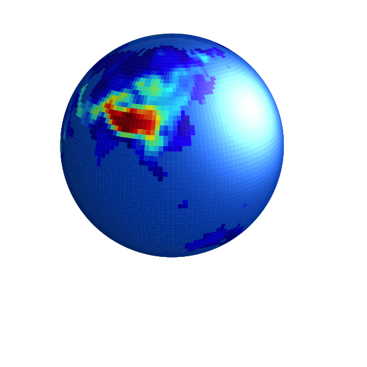
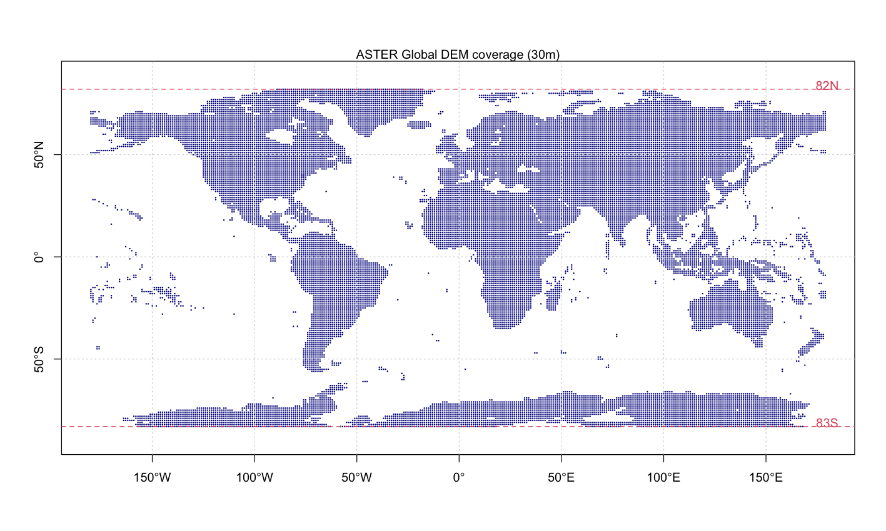
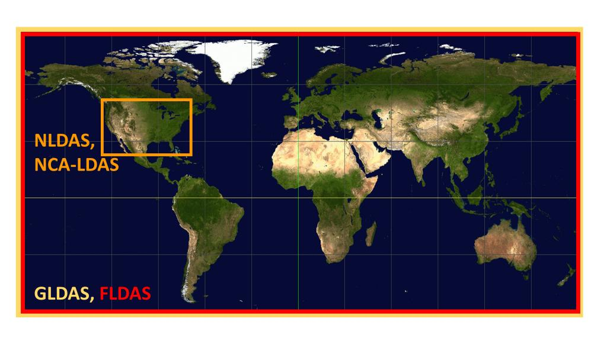

## What is the GHDC

The Global Hydrologic Data Cloud (GHDC)is to provide a rapid and reproducible hydrological model development in any watershed, any continent, or any country. The users provide the watershed boundary, GHDC will do the data retrieve, subset clipping, reprojection, spatial-temporal data pre-processing, and so forth. Then, the user will receive a download link for the watershed.

### License

We do not produce data, but process data for modelers. So the license and right belong to original data creators. The current datasets support Public Domain, that allows reprocess and redistribute the data.

### Data Source

| Category                | Data name       | Feature                   | License       | Data source |
|:------------------------|:----------------|:--------------------------|:--------------|:------------|
| Elevation               | ASTER GDEM      | Global 30m                | Public Domain |             |
| Landuse                 | USGS Land Cover | Global 1km                | Public Domain |             |
| Soil                    | HWSD v1.0       | Global 1km                | Public Domain |             |
| Reanalysis forcing data | GLDAS           | Global 0.25deg, 1950-     | Public Domain |             |
| Reanalysis forcing data | FLDAS           | Continental 0.1deg, 1979- | Public Domain |             |
| Reanalysis forcing data | NLDAS           | US 0.125deg, 1979-        | Public Domain |             |
| Reanalysis forcing data | CLDAS           | China 0.125deg            | **private**   |             |
| Reanalysis forcing data | CMFD            | China 0.1deg              | **private**   |             |
|                         |                 |                           |               |             |

## How to require a data service

1.  Provide the watershed boundary. The file is in ESRI Shapefile format. The shapefile (including the .shp, .dbf, .shx, .prj files) must be ziped in a .zip file, and uploaded to GHDC.
2.  Fill the form of parameters.
3.  Fill your email address, and submit your request.
4.  Check you email and click the confirm link in the email from GHDC. After your confirmation, the GHDC starts data processing.
5.  After GHDC data processing, you will received the second email, which includes a download link. Please download the data within 14 days.
6.  Enjoy your data and modeling journey.

## References/citations

For giving right credits to the platform developers, model developers and data creators, we suggest our users strongly to add following citations into your future work.

-   SHUD:

    -   Shu, L., Ullrich, P. A., & Duffy, C. J. (2020). Simulator for Hydrologic Unstructured Domains (SHUD v1.0): numerical modeling of watershed hydrology with the finite volume method. Geoscientific Model Development, 13(6), 2743--2762. <https://doi.org/10.5194/gmd-13-2743-2020>
    -   Shu L.,Chang Y.,Wang J.,et al. A brief review of numerical distributed hydrological model SHUD［J］. Advances in Earth Science,2022,37（7）: 680-691. DOI: 10.11867/j.issn.1001-8166.2022.025.

-   NLDAS

    -   Cosgrove, B. A. (2003). Real-time and retrospective forcing in the North American Land Data Assimilation System (NLDAS) project. Journal of Geophysical Research, 108(D22), 8842. <https://doi.org/10.1029/2002JD003118>

-   Landuse, USGS 0.5 km MODIS-based Global Land Cover Climatology

    -   Broxton, P.D., Zeng, X., Sulla-Menashe, D., Troch, P.A., 2014a: A Global Land Cover Climatology Using MODIS Data. J. Appl. Meteor. Climatol., 53, 1593-1605. doi: <http://dx.doi.org/10.1175/JAMC-D-13-0270.1>

## Acknowledge

Thanks to the funding supporters.

-   Chinese Academy of Sciences, BR program: Numerical hydrological model development
-   Key Laboratory of Land Surface Process and Climate Change in Cold and Arid Regions, Chinese Academy of Sciences: Coupled CLM-SHUD model development
-   Qinghai Key Laboratory of Disaster Prevention: Streamflow change and hydrological mechanism in Buha River (Grant No. QFZ-2021-Z02).
-   National Cryosphere Desert Data Center (NCDC) : Automatic hydrological model deployment system.
-   Department of Energy (USA), Knowledge-Guided Machine Learning: A Framework to Accelerate Scientific Discovery
-   National Science Fundation (USA), Model Integration through Knowledge-Rich Data and Process Composition

## Wechat Group

Scanning the QR code follows our Wechat official page.

You may scan the following QR code to add the admin, then join the Wechat group.

